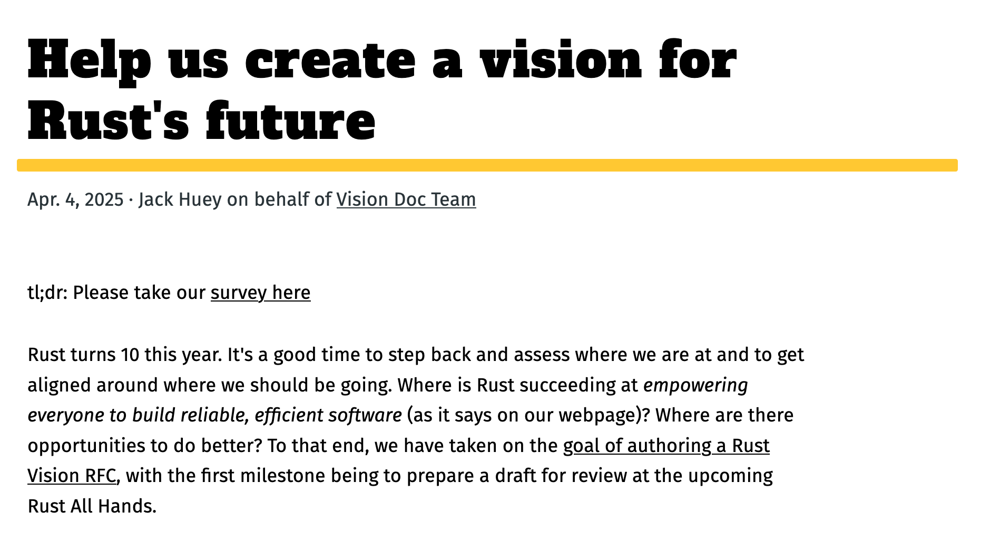

class: center
name: title
count: false

# SW Eng @ Broad

.p60[]

.me[.grey[*by* **Nicholas Matsakis**]]
.left[.citation[View slides at `https://nikomatsakis.github.io/broad-25/`]]

---

# A short biography

| | |
| --- | --- |
| 1997-2001 | Undergrad at MIT |
| 2004-2011 | PhD at ETH Zurich |
| 2011-2021 | Working on Rust @ Mozilla |
| 2021-     | Working on Rust @ Amazon |

I also have a blog at [smallcultfollowing.com/babysteps](https://smallcultfollowing.com/babysteps).

---

# Why am I here?

.hugest[🤔]

???

To be honest, I don't know! I was surprised and rather delighted to receive the invitation. 

Before coming here, the main thing I knew about the Broad was that it was not pronounced "broad". 

Anyway, I've been wanting to learn more about scientific computing for a while now, so I was pretty excitied to see the invite come by. I figured this was an opportunity I couldn't pass up.

---

# Rust 2025 Vision Doc

[](https://blog.rust-lang.org/2025/04/04/vision-doc-survey.html)

.footnote[[Blog post here](https://blog.rust-lang.org/2025/04/04/vision-doc-survey.html)]

???

But also, the timing was impeccable.

It just so happens that I've been working on a project called the Rust Vision Doc.

What is this? Well, Rust has been going strong for 10 years.

When we started out looking to create a viable alternative to C and C++, conventional wisdom was that we didn't have a chance.

In fact, I didn't think we had a chance!

But hey, we've made some serious in-roads, and the future continues to look bright.

So it's a good time for us to stop and take stock of the work we've done and decide what's next.

---

# Looking beyond adoption

What is it all **for**?

--

I want all programs to be written in Rust?

--

Nope.

--

I want the *right* programs to be written in Rust?

--

Nope.

???

One of my themes is that I want to get past adoption.
Early on for Rust, growing and finding users was kind of axiomatically good.
But I think at some point we have to ask ourselves, who are we doing this for?

I don't expect, or even want, all programs to be written in Rust.

In fact, I was going to say something like "I want the *right* programs to be written in Rust"--
but I don't even think that's quite right.
I mean, I won't lie, I want people to use Rust.
But I feel like one thing I've learned is not to set my goals based on things I can't control. 

---

# Rust's sweet spot

I want Rust to be a fantastic choice for writing ...

### [Foundational software.](https://smallcultfollowing.com/babysteps/blog/2025/03/10/rust-2025-intro/)

That is, the software that underpins<sup>1</sup> everything else.

.footnote[<sup>1</sup> Little Rust-insider pun for y'all there. If you don't get it, count yourself lucky.]

???

Nah, what I *really* want is for Rust to *be* a fantastic choice.
I think that will naturally lead to others picking it, but ultimately people make choices for a lot of reasons, and that's cool.
Of course, being "a fantastic choice" begs the question, a fantastic choice *for what?*

Rust actually covers a lot of ground. We've seen big pick-up in networked systems. 
Embedded systems. CLI applications. Developer tooling. 
A lot of different stuff. 
These areas cover a wide variety of requirements, 
but one thing I think they all have in common is that they are **foundational systems**.
They are the systems that underlie everything else.

---

# What makes Foundational systems different?

|     | What makes Rust *Rusty?* |
| :-- | :-- |
| ⚙️ | Reliable |
| 🏎️ | Performant, composable abstractions |
| 🔧 | Low-level control and transparency |
| 🌟 | Extensible and productive |
| 🤸🏾 | Accessible and supportive |

---

# 🤸🏾 Accessible and supportive

"Systems programming...not just for wizards anymore"

---
name: barbara
# Let's tell a story

```rust
fn make_thumbnails(images: &[Image]) -> Vec<Image> {
    images
        .par_iter()
        .map(|image| image.make_thumbnail())
        .collect()
}
```

.abspos.left30.top350[]

---
template: barbara

.arrow.abspos.left50.top180.rotE[]

.abspos.left300.top415[
.speech-bubble.left.barbara[
Rayon makes this so easy!
]]


---
template: barbara

.abspos.left500.top350[]

.abspos.left300.top415[
.speech-bubble.left.barbara[
I want you to<br>
modify this.
]]

---

# Building a community

It's a work in progress, and it always will be

---

# Different goals

* Attract contributors
    * Empower customers to scratch their own itch, shape direction.
    * Company retains ownership, direction.
* Create a community-owned project
    * Committed contributors become maintainers, set direction.

---

# It all starts with empathy

> **Empathy.** The ability to understand and share the feelings of another.

---

# Us vs them

Easy to fall into "us vs them" thinking

Developers vs maintainers

---

# What would it be like...

Imagine you did not work at the Broad, what would it be like to contribute to this project?

---

# Clarity is kindness

Don't make promises you don't want to keep.

---

# Different roles

* Contributor
    * Does the development

vs

* Maintainer
    * Decides what to accept, what direction to go

---

# Step 0: Develop in public

* This is not *open source*:<sup>1</sup>
    * Write code in your private repository
    * Publish the code publicly once in a while

.small[
    <sup>1</sup> Not in my book, anyway.
]

---

# Step 1: Talk and develop in public

What everyone does: Setup a Zulip, a discord, a mailing list, something.

What people rarely do: **Use it.**

???

How many folks

---

# Step 2: Build your process as you go

Tempting to create an ornate process from the start.

Don't.

--

Minimum viable model:

* Defined core team that decides what to accept, reject
* [Lazy consensus](https://community.apache.org/committers/decisionMaking.html#lazy-consensus)

---

# Why wasn't I consulted?

.hugest[😡]

.abspos.left300.top275[
.speech-bubble.left.barbara[
You did WHAT?
]]

---

# Anger is a signal

Is someone rude and angry? Two options

* They're a jerk.
* They've got a legitimate grievance and they're handling it poorly.

Not mutually exclusive.

Either way, it's an opportunity.

---

# Write it !@#!$ down

* RFCs
    * Get alignment on the direction *first*
    * *Then* implement

---

# Articulating a vision

---

# Rust as the foundation of...whatever it is you do

* For those of you who use Rust, what brought you to use Rust?
    * What works well for you?
* For those of you who don't use Rust, have you considered it?
    * For what? What did you use instead?

...Come talk to me. I'm curious!

<hr>

Oh, and fill out the survey:

[blog.rust-lang.org/2025/04/04/vision-doc-survey.html](https://blog.rust-lang.org/2025/04/04/vision-doc-survey.html)

[www.surveyhero.com/c/fuznhxp3](https://www.surveyhero.com/c/fuznhxp3)