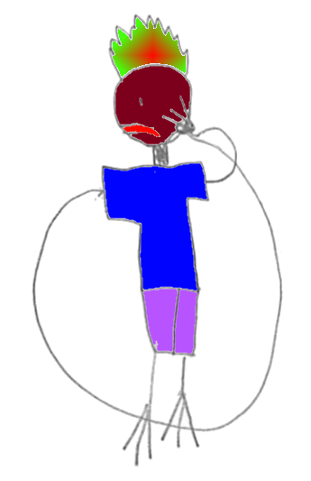

class: center
name: title
count: false

# SW Eng @ Broad

.p60[]

.me[.grey[*by* **Nicholas Matsakis**]]
.left[.citation[View slides at `https://nikomatsakis.github.io/broad-25/`]]

---

# A short biography

| | |
| --- | --- |
| 1997-2001 | Undergrad at MIT |
| 2004-2011 | PhD at ETH Zurich |
| 2011-2021 | Working on Rust @ Mozilla |
| 2021-     | Working on Rust @ Amazon |

I also have a blog at [smallcultfollowing.com/babysteps](https://smallcultfollowing.com/babysteps).

---

# Why am I here?

.hugest[🤔]

???

To be honest, I don't know! I was surprised and rather delighted to receive the invitation. 

Before coming here, the main thing I knew about the Broad was that it was not pronounced "broad". 

As an I feel like living in Massachusetts is basically a series of learning how to pronounce things.

You know what I mean. Gloucester, Gloucester.

Broad, Broad.

Heck, if you live in Somerville, there is a Jaques St, which of courses is pronounced Jakes.

Anyway, I've been wanting to learn more about scientific computing for a while now, so I was pretty excitied to see the invite come by. I figured this was an opportunity I couldn't pass up.

---

# Rust 2025 Vision Doc

[](https://blog.rust-lang.org/2025/04/04/vision-doc-survey.html)

.footnote[[Blog post here](https://blog.rust-lang.org/2025/04/04/vision-doc-survey.html)]

???

But also, the timing was impeccable.

It just so happens that I've been working on a project called the Rust Vision Doc.

What is this? Well, Rust has been going strong for 10 years.

When we started out looking to create a viable alternative to C and C++, conventional wisdom was that we didn't have a chance.

In fact, I didn't think we had a chance!

But hey, we've made some serious in-roads, and the future continues to look bright.

So it's a good time for us to stop and take stock of the work we've done and decide what's next.

---

# Looking beyond adoption

What is it all **for**?

--

I want all programs to be written in Rust?

--

Nope.

--

I want the *right* programs to be written in Rust?

--

Nope.


???

One of my themes is that I want to get past adoption.
Early on for Rust, growing and finding users was kind of axiomatically good.
But I think at some point we have to ask ourselves, who are we doing this for?

I don't expect, or even want, all programs to be written in Rust.

In fact, I was going to say something like "I want the *right* programs to be written in Rust"--
but I don't even think that's quite right.
I mean, I won't lie, I want people to use Rust.
But I feel like one thing I've learned is not to set my goals based on things I can't control. 

---

# Rust's sweet spot

I want Rust to be a fantastic choice for writing ...

### [Foundational software.](https://smallcultfollowing.com/babysteps/blog/2025/03/10/rust-2025-intro/)

That is, the software that underpins<sup>1</sup> everything else.

.footnote[<sup>1</sup> Little Rust-insider pun for y'all there. If you don't get it, count yourself lucky.]

???

Nah, what I *really* want is for Rust to *be* a fantastic choice.
I think that will naturally lead to others picking it, but ultimately people make choices for a lot of reasons, and that's cool.
Of course, being "a fantastic choice" begs the question, a fantastic choice *for what?*

Rust actually covers a lot of ground. We've seen big pick-up in networked systems. 
Embedded systems. CLI applications. Developer tooling. 
A lot of different stuff. 
These areas cover a wide variety of requirements, 
but one thing I think they all have in common is that they are **foundational systems**.
They are the systems that underlie everything else.

---

# What makes Foundational systems different?

| | What makes Rust *Rusty?* | |
| :-- | :-- | :-- |
| ⚙️ | Reliable | |
| 🏎️ | Performant, composable abstractions | |
| 🔧 | Low-level control and transparency | |
| 🌟 | Extensible and productive | |
| 🤸🏾 | Accessible and supportive | |

---

# 🤸🏾 Accessible and supportive

"Systems programming...not just for wizards anymore"

---

# Let's tell a story


.footnote[
    Artistic credit goes to my daughter.
]

???

To better understand the value prop, we're going to tell a story, and it starts with Barbara. She's a Rust programmer. She's also a drawing that my daughter made some years back and that I kind of love to death.

---
name: thumbnails

# Let's tell a story

```rust
fn make_thumbnails(images: &[Image]) -> Vec<Image> {
    images
        .par_iter()
        .map(|image| image.make_thumbnail())
        .collect()
}
```

.abspos.left30.top350[]


???

Barbara is working on an app collecting people's data.
She needs to take a list of images and create thumbnails for them.
She sits down and bangs out this code high-level code.

---
template: thumbnails

.arrow.abspos.left50.top180.rotE[]

.abspos.left300.top415[
.speech-bubble.left.barbara[
*Rayon makes this so easy!*
]]

---
template: thumbnails

.arrow.abspos.left50.top210.rotE[]

.abspos.left300.top415[
.speech-bubble.left.barbara[
*Just gotta make a thumbnail for each image...*
]]


---
template: thumbnails

.arrow.abspos.left50.top240.rotE[]

.abspos.left300.top415[
.speech-bubble.left.barbara[
*...and build a vector. Done. That was easy!*
]]

???

Now, there's nothing particularely special about this code.

You could write code like this in 100 different languages.

You could write code like this in Java. It wouldn't be as efficient, but for this particular example it wouldn't matter much.

You could write code like this in C++, if you had the right libraries.

But what makes Rust really special is what happens next.

---
name: meetalan
# Barbara gets an intern, Alan

```rust
fn make_thumbnails(images: &[Image]) -> Vec<Image> {
    images
        .par_iter()
        .map(|image| image.make_thumbnail())
        .collect()
}
```

.abspos.left30.top350[]

.abspos.left500.top350[]

???

Well, some time later, Barbara has an intern Alan.

---
template: meetalan

.abspos.left300.top415[
.speech-bubble.left.barbara[
Your job is to<br>add telemetry
]]

???

She tells Alan that his job is to add telemetry to their app, measuring how many thumbnails they create.

--

.abspos.left420.top550[
.speech-bubble.right.alan[
OK!
]]

???

"No problem", he says!

---
name: thumbnailsbug

# Let's tell a story

```rust
fn make_thumbnails(images: &[Image]) -> Vec<Image> {
    let mut counter = 0;
    let vec = images
        .par_iter()
        .map(|image| {
            counter += 1; 
            image.make_thumbnail()
        })
        .collect();
    log(counter);
    vec
}
```

.abspos.left500.top350[]

???

So Alan gets to work. He's not terribly experienced.

---
template: thumbnailsbug

.line2[]

.abspos.left170.top475[
.speech-bubble.right.alan[
Let's see, I'll need a counter...
]]

???

He starts by adding a counter.

---
template: thumbnailsbug

.line6[]

.abspos.left170.top475[
.speech-bubble.right.alan[
...add 1 for each image...
]]

???

Adding one for each image.

---
template: thumbnailsbug

.line10[]

.abspos.left170.top475[
.speech-bubble.right.alan[
...and log it for telemetry. Done!
]]

???

and finally logging the result to telemetry. Looks pretty good!

---
template: thumbnailsbug

.abspos.left250.top350.fliplr[]

.abspos.left280.top440[
.thought.barbara.bubble1[&nbsp;]
]

.abspos.left310.top410[
.thought.barbara.bubble2[&nbsp;]
]

.abspos.left340.top390[
.thought.barbara.bubble3[&nbsp;]
]

.abspos.left25.top475[
.speech-bubble.barbara[
*I'm ready for lunch.*
]]

???

He opens up his PR for Barbara to review.
She's hungry, and she's got a lot on her mind.


--

.abspos.left25.top570[
.speech-bubble.barbara.right[
Looks great! Ship it!
]]

???

She reads it quickly and says "look pretty good! ship it!" So that code goes into production.

--

.line6[]

???

But wait! There's a bug! You see, when you have a `+= 1` like this, it can't actually be used from multiple threads. To see why, think about how a computer adds a number. It first has to read from memory, then it adds one, then it writes the reuslt back. So if you have two parallel threads, and they are both running at the same time, they can both go and read the same value, say 0, add 1 to to it, yielding 1, and then both write the same result back. Now you made two thumbnails, but your counter just says 1.

This is the worst kind of bug because, in practice, the code is going to run. The only thing is that your telemetry result will just silently be off. Eventually you might notice, but probably not for a long time. --- oh, wait. That's not what happens. I forget! We're using Rust!

---
.page-center[

]

???

Let's rewind and try that again.

---
template: thumbnailsbug

.line10[]

.abspos.left170.top475[
.speech-bubble.right.alan[
...and log it for telemetry. Done!
]]

???

So, back when Alan has finished his PR, he goes to see if it builds and run some tests -- and wait, it won't compile!

---
template: thumbnailsbug
name: thumbnailsbugferris

.line6[]

.abspos.left235.top320.p60[

]

.abspos.left25.top540[
.speech-bubble.topright.ferris[
Hold up there buddy!<br>
This could cause a data race!
]]

???

Rust's type system will not permit you to modify a counter like this from two threads at once. The compiler helpfully points out there's a data race.

---
template: thumbnailsbug

.line6[]

.abspos.left235.top320.p60[

]

.abspos.left150.top570[
.speech-bubble.right.alan[
Gee, thanks Ferris! My hero!
]]

???

Alan is able to fix it and feels great about himself.

---
.page-center[

]

???

Well, almost. I'm kind of simplifying it. Let's see what *really* happens.

---

template: thumbnailsbug

.line6[]

.abspos.left235.top320.p60[

]

.abspos.left25.top540[
.speech-bubble.topright.ferris[
    Cannot assign to `counter`, as it is a<br>
    captured variable in a `Fn` closure
]]

???

In reality, the compiler gives an error like this. (read in robot voice)

---
template: thumbnailsbug
name: stupid-compiler

.abspos.left500.top350[]

---
template: stupid-compiler

.abspos.left350.top475[
.speech-bubble.right.alan[
Stupid compiler.
]]

.abspos.left300.top580[
.speech-bubble.right.alan[
Help me!
]]

???

Honestly, Alan is probably fairly confused. He says "Man, Rust is hard! Barbara, help!"

---
template: stupid-compiler

.abspos.left250.top350.fliplr[]

.abspos.left75.top475[
.speech-bubble.barbara.right[
Ah, yeah, this.<br>
Use `AtomicUsize`.
]]

???

Now Barbara takes a look. She's seen this before, and knows what that error means, and how to fix it.

---
name: thumbnailsfixed

# Let's tell a story

```rust
fn make_thumbnails(images: &[Image]) -> Vec<Image> {
    let counter = AtomicUsize::new();
    let vec = images
        .par_iter()
        .map(|image| {
            counter.fetch_add(1, Ordering::Relaxed);
            image.make_thumbnail()
        })
        .collect();
    log(counter.load(Ordering::Relaxed));
    vec
}
```

.abspos.left500.top350[]

.line2[]
.line6[]
.line10[]

.footnote[Surprised to see `Ordering::Relaxed`? Read [Mara's book!](https://marabos.nl/atomics/)]

???

Alan rewrites his code to use `AtomicUsize`, which will ensure the counter is correct, even if multiple threads are executing.

---
template: thumbnailsfixed

.abspos.left320.top470[
.speech-bubble.right.alan[
Welp, now I know!
]]

???

This is cool! Alan learned something! Now he knows about data races, and he'll take that knowledge with him, hopefully helping avoid bugs even when using languages that are not Rust.

---

# Key takeaways

* Idiomatic code is performant code

--
* Rust makes parallelism (relatively) easy and reliable

--
* Reliable code not only works, it keeps working as it is changed

---

# Rust 2025 Vision Doc

[](https://blog.rust-lang.org/2025/04/04/vision-doc-survey.html)

---

# Rust as the foundation of...whatever it is you do

* For those of you who use Rust, what brought you to use Rust?
    * What works well for you?
* For those of you who don't use Rust, have you considered it?
    * For what? What did you use instead?

...Come talk to me. I'm curious!

<hr>

Oh, and fill out the survey:

[blog.rust-lang.org/2025/04/04/vision-doc-survey.html](https://blog.rust-lang.org/2025/04/04/vision-doc-survey.html)

[www.surveyhero.com/c/fuznhxp3](https://www.surveyhero.com/c/fuznhxp3)